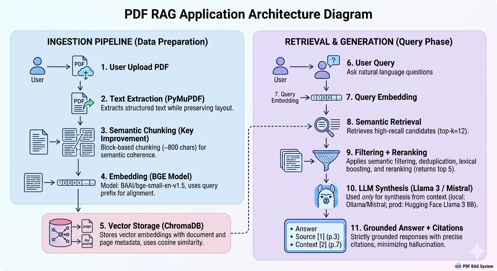

# 📄 PDF RAG Application

A Retrieval-Augmented Generation (RAG) system for querying research papers with accurate, citation-backed answers.

---

## 🚀 Overview

This application allows users to:

* Upload research papers (PDFs)
* Ask natural language questions
* Receive **grounded answers with precise citations**

Designed to prioritize **factual accuracy and grounded responses over generative completeness**, making it suitable for research-grade question answering.

The system ensures **minimal hallucination** by combining semantic retrieval with strict answer grounding.

---

## 🧠 System Architecture

### 🔹 End-to-End Pipeline

1. **PDF Ingestion**

   * Extracts structured text using PyMuPDF (`get_text("blocks")`)
   * Preserves document layout (important for research papers)

2. **Semantic Chunking (Key Improvement)**

   * Uses block-based chunking instead of fixed character splitting
   * Merges logically related text into chunks (~800 chars)
   * Maintains semantic coherence and avoids breaking sentences

3. **Embedding**

   * Model: `BAAI/bge-small-en-v1.5`
   * Converts text into dense vector embeddings
   * Query uses `"query:"` prefix for improved semantic alignment

4. **Vector Storage**

   * Stored in ChromaDB with metadata:

     * source document
     * page number
   * Uses cosine similarity for retrieval

5. **Semantic Retrieval**

   * Retrieves top-k candidates (**k = 12**) for high recall
   * Applies filtering, deduplication, and reranking
   * Returns top 5 high-quality chunks for answer generation
   * Uses semantic similarity + lightweight lexical boosting  
     → improves accuracy for definition-style queries

6. **LLM-based Answer Generation**

   * Model:
     * Local: Ollama (Mistral)
     * Production: Hugging Face Inference API (Meta Llama 3 8B Instruct)
   * LLM is used **only for answer synthesis from retrieved context**, not for knowledge generation
   * Enforces strictly grounded responses

7. **Output + Citations**

   * Displays final answer
   * Shows supporting sources (document + page)
   * Provides retrieved context for transparency

---

## 🔍 Key Features

* ✅ **Semantic Search (NOT keyword matching)**
* ✅ **Structure-aware Semantic Chunking**
* ✅ **High Recall + Precision Retrieval Pipeline**
* ✅ **Grounded Answer Generation (no hallucination)**
* ✅ **Source Citations (page-level)**
* ✅ **Transparent Retrieval Display**
* ✅ **Multi-PDF Support**

---

## 🧩 Advanced Retrieval Improvements

* Query-aware reranking for definition-style queries
* Duplicate chunk removal for cleaner context
* Confidence-based filtering using similarity scores
* High-recall retrieval followed by precision filtering

---

## ⚙️ Tech Stack

* **Frontend**: Streamlit
* **PDF Parsing**: PyMuPDF
* **Embeddings**: SentenceTransformers (`bge-small-en-v1.5`)
* **Vector DB**: ChromaDB
* **LLM**:
  * Local: Ollama (Mistral)
  * Production: Hugging Face Inference API (Meta Llama 3 8B Instruct)

---

## 🧠 Design Decisions (Important)

* **Semantic embeddings over keyword search**  
  → improves robustness to query phrasing  

* **Structure-aware chunking instead of fixed-size splitting**  
  → preserves meaning and improves retrieval quality  

* **High recall (k=12) + precision filtering (top 5)**  
  → ensures relevant context is not missed  

* **LLM used only for grounded extraction**  
  → improves explainability and reduces hallucination  

* **Strict prompting + post-filtering**  
  → enforces factual correctness  

* **Environment-aware model switching**  
  → uses Ollama locally and Hugging Face API in production  

---
## 🧩 Architecture Diagram


## 🧪 Example Queries

* What is self-attention?
* What optimizer is used in the paper?
* Why is scaling applied in dot-product attention?
* What is DeepSeek-R1-Zero?

---

## 🧪 Evaluation Insight

The system performs strongly on:
- Definition-based queries  
- Concept explanation questions  
- Fact retrieval from research papers  

Performance may degrade for:
- Figure/table-specific queries (not yet supported)  
- Highly implicit or cross-section reasoning questions  

---

## ⚠️ Limitations

* Does not currently process:
  * Images
  * Tables
  * Figures

* Retrieval quality depends on text extraction accuracy

---

## 🔮 Future Improvements

* Multimodal RAG (images, tables, figures)
* OCR integration for scanned PDFs
* Section-aware semantic chunking
* Cross-encoder reranking for higher precision

---

## ▶️ How to Run

```bash
pip install -r requirements.txt
streamlit run app.py
